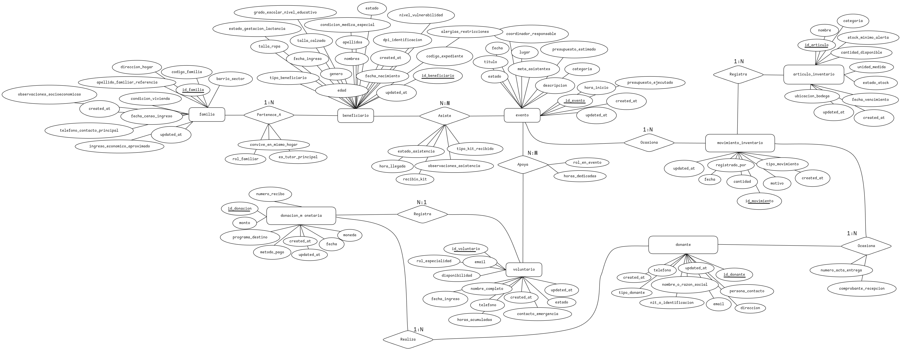
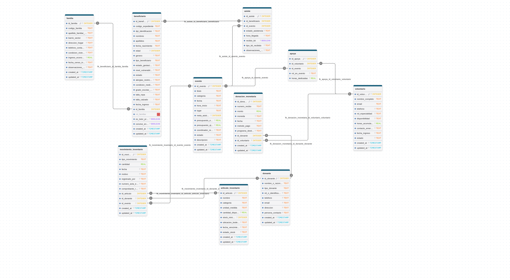

# Documentación Técnica — Modelo de Base de Datos

En este documento se describe la arquitectura del modelo de datos de **Lumbreras de Amor**, el cual se encuentra implementado mediante **Prisma ORM** y **libSQL (SQLite / Turso)** en el paquete `packages/database`.

---

## 1. Diagramas Entidad-Relación (ER)

El diseño de la base de datos se estructuró a partir de dos perspectivas complementarias: el modelo conceptual de entidades y relaciones, y el modelo físico relacional con tipos de datos, cardinalidades y claves foráneas.

### 1.1 Diagrama ER Conceptual (Chen)
Representa las entidades del dominio, sus atributos fundamentales y las cardinalidades de las relaciones:



### 1.2 Diagrama Físico Relacional
Detalla la estructura exacta de las tablas, claves primarias (`PK`), claves foráneas (`FK`), tipos de datos SQLite y restricciones de nulabilidad:



---

## 2. Entidades y Módulos del Sistema

El esquema cubre diez modelos relacionales organizados en los siguientes ejes operativos:

### 2.1 Familias y Expedientes de Beneficiarios
- **`Familia` (`familia`)**: Representa el núcleo del hogar censado. Almacena código único (`codigo_familia`), dirección, sector/barrio, condición de vivienda, ingreso económico estimado y fecha de censo.
- **`Beneficiario` (`beneficiario`)**: Representa a cada integrante vinculado a una familia (`id_familia`), distinguiendo mujeres (núcleo del programa), niños/as y otros adultos. Incluye datos de identificación (`codigo_expediente`, `dpi_identificacion`), vulnerabilidad, estado de gestación/lactancia, condiciones médicas/alergias, tallas y rol familiar (`rol_familiar`, `es_tutor_principal`).

### 2.2 Eventos, Jornadas Comunitarias y Asistencia
- **`Evento` (`evento`)**: Control de jornadas, talleres comunitarios y entregas de víveres. Registra fecha, hora, lugar, categoría, metas de asistencia, presupuesto estimado/ejecutado y coordinador responsable.
- **`Asiste` (`asiste`)**: Tabla intermedia que vincula a un `Beneficiario` con un `Evento`. Registra estado de asistencia, hora de llegada, entrega de kits/raciones (`recibio_kit`, `tipo_kit_recibido`) y observaciones.

### 2.3 Voluntariado y Asignación Operativa
- **`Voluntario` (`voluntario`)**: Directorio de voluntarios con datos de contacto, especialidad/profesión, disponibilidad, contacto de emergencia y horas acumuladas de servicio.
- **`Apoya` (`apoya`)**: Tabla intermedia que asigna voluntarios a eventos específicos (`id_voluntario`, `id_evento`), documentando el rol desempeñado y las horas dedicadas.

### 2.4 Donantes y Donaciones Monetarias
- **`Donante` (`donante`)**: Registro de benefactores particulares y corporativos (razón social, NIT/identificación, tipo de donante y persona de contacto).
- **`DonacionMonetaria` (`donacion_monetaria`)**: Registro de ingresos monetarios con número de recibo único (`numero_recibo`), monto, moneda, método de pago, programa de destino y vinculación opcional con el donante o voluntario que gestionó la recepción.

### 2.5 Inventario y Movimientos de Insumos
- **`ArticuloInventario` (`articulo_inventario`)**: Catálogo de víveres, ropa, juguetes e insumos. Maneja unidad de medida, cantidad disponible, umbral de stock mínimo (`stock_minimo_alerta`), ubicación en bodega, fecha de vencimiento y estado de stock.
- **`MovimientoInventario` (`movimiento_inventario`)**: Bitácora de entradas y salidas de inventario vinculadas al artículo (`id_articulo`), con trazabilidad a donantes (donaciones en especie) o a eventos comunitarios (salida de raciones e insumos), número de acta y comprobante.

---

## 3. Resumen de Modelos en Prisma (`packages/database/prisma/schema.prisma`)

| Modelo Prisma | Tabla SQL | Clave Primaria | Claves Foráneas Principales |
| :--- | :--- | :--- | :--- |
| `Familia` | `familia` | `id_familia` | — |
| `Beneficiario` | `beneficiario` | `id_beneficiario` | `id_familia` → `familia` |
| `Evento` | `evento` | `id_evento` | — |
| `Asiste` | `asiste` | `id_asiste` | `id_beneficiario`, `id_evento` |
| `Voluntario` | `voluntario` | `id_voluntario` | — |
| `Apoya` | `apoya` | `id_apoya` | `id_voluntario`, `id_evento` |
| `Donante` | `donante` | `id_donante` | — |
| `DonacionMonetaria` | `donacion_monetaria` | `id_donacion` | `id_donante`, `id_voluntario` |
| `ArticuloInventario` | `articulo_inventario` | `id_articulo` | — |
| `MovimientoInventario` | `movimiento_inventario` | `id_movimiento` | `id_articulo`, `id_donante`, `id_evento` |

---

## 4. Comandos de Mantenimiento

Desde la raíz del monorepo:

```bash
# Validar la sintaxis y relaciones del esquema
pnpm --filter @lumbreras/database exec prisma validate

# Formatear el archivo schema.prisma
pnpm --filter @lumbreras/database exec prisma format

# Generar el cliente tipado de Prisma
pnpm --filter @lumbreras/database generate

# Ejecutar pruebas unitarias de la capa de base de datos
pnpm test
```